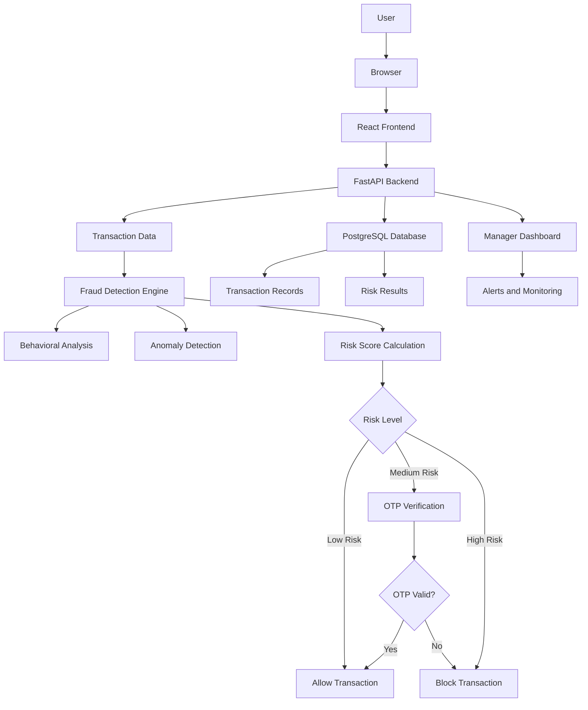

# Architecture

## System Architecture

Our system uses a React frontend, FastAPI backend, fraud detection engine, PostgreSQL database, and manager dashboard.

### Architecture Diagram

## Components

| Component | Technology | Responsibility |
|---|---|---|
| Frontend | React 18 | Dashboard UI, user interaction |
| Backend API | FastAPI | Business logic, orchestration |
| AI / ML | watsonx.ai | Anomaly scoring, classification |
| Database | PostgreSQL | Storing pipeline events and scores |
| Notifications | Slack API | Alerting on threshold breaches |

## Data Flow

1. Users submit transaction details through the React-based AURA Security Vault interface.
2. The frontend sends the transaction data to the FastAPI backend through REST API requests.
3. The backend validates and preprocesses the transaction data before sending it to the Fraud Detection Engine.
4. The Fraud Detection Engine analyzes transaction behavior, detects anomalies, and calculates a risk score.
5. Transaction details and analysis results are stored and retrieved from PostgreSQL for monitoring and historical analysis.
6. The calculated risk result is returned to the frontend, where users can receive warnings or alerts for potentially risky transactions.
7. Risk alerts and transaction activity are also displayed on the Manager Dashboard for monitoring and review.

## Security Considerations
- API keys and database credentials are stored in environment variables and excluded from Git.
- Input data is validated by the FastAPI backend before processing.
- The frontend communicates with the database only through controlled backend APIs.
- Manager functionality is separated from the standard user interface.
- Sensitive banking credentials such as passwords, PINs, and OTPs are not collected or stored.
- PostgreSQL stores transaction and risk-analysis data securely.
