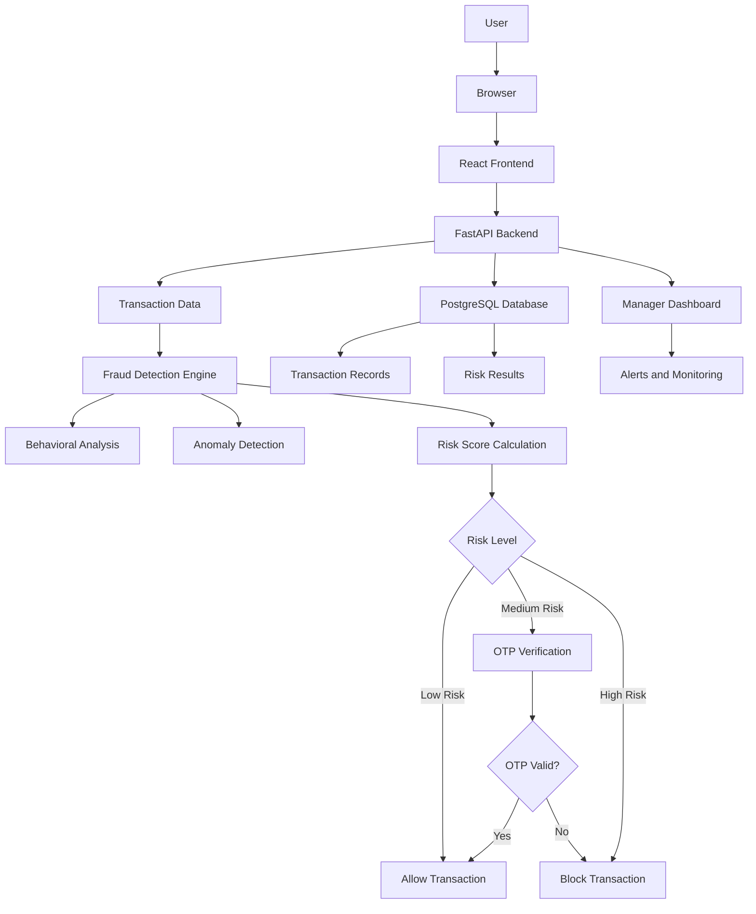

# Solution Overview

## What We Built

We built a Fraud Detection System for digital banking that identifies potentially suspicious transactions and applies different security measures based on the level of risk.
The system asks the customer for permission before using transaction history and location information. It then analyzes the transaction and makes a security decision without showing the customer the actual risk percentage. Genuine low-risk transactions can proceed normally, medium-risk transactions require OTP verification, and high-risk transactions are blocked.

## How It Works

1. Customer enters banking details and transaction information.
2. The system asks for customer permission to access transaction history.
3. The system asks for permission to use location information.
4. The system analyzes factors such as transaction amount, transaction history, transaction pattern, and location.
5. A risk score is calculated internally and is not shown to the customer.
6. Low risk: The transaction is allowed.
7. Medium risk (50–75%): The customer receives an OTP for verification.
8. High risk (>75%): The transaction is blocked.
9. The system displays the appropriate result to the customer.

## Architecture Diagram

> See [`architecture.md`](architecture.md) for the detailed diagram.


```
[User] → [Frontend: React] → [API: FastAPI] → [watsonx.ai] → [Dashboard]
                                    ↓
                             [PostgreSQL DB]
```

## Key Design Decisions

| Decision | Rationale |
|---|---|
| [e.g., Used watsonx.ai for anomaly detection] | [e.g., Pre-trained models reduced time-to-value vs. building from scratch] |
| [Decision 2] | [Rationale 2] |
| [Decision 3] | [Rationale 3] |

## IBM Technologies Used

- **[IBM Tech 1, IBM watsonx.ai is used as the AI inference service for analyzing transaction data and supporting fraud-risk detection and scoring.
